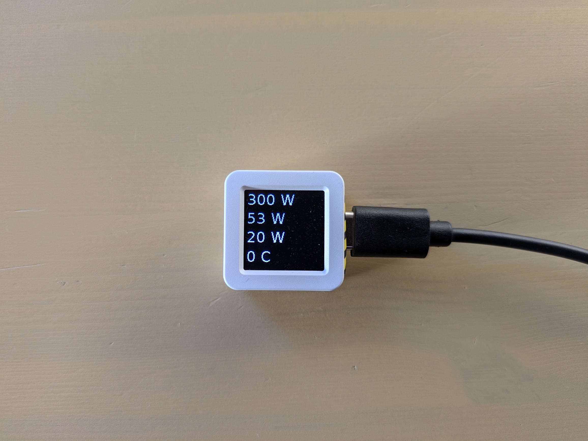

# m5stack_mqtt_client

## Description

Use the M5Stack ATOMS3 dev kit as an mqtt client to display arbitrary information. 



In this repo it's used to display information about a small solar inverter whose information is pulled via [OpenDTU](https://github.com/tbnobody/OpenDTU) and the information subsequently pushed to mqtt.

We use the given micropython environment to implement all our functionality. This project was based on [UIFLOW 2.2.x](https://uiflow2.m5stack.com/) at the time of writing.

The product is often listed as 

```
M5Stack Official ATOMS3 Dev Kit w/ 0.85-inch Screen
```

[](https://shop.m5stack.com/products/atoms3-dev-kit-w-0-85-inch-screen)
